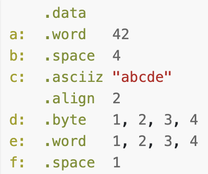

# Arrays/memory in MIPS

3. Give MIPS directives to represent the following variables:

   a) `int u;`

   ```assembly
   u:				.space 4
   ```

   b) `int v = 42;`

   ```assembly
   v:				.word	 42
   ```

   c) `char w;`

   ```assembly
   w:				.space 1
   ```

   d) ```char x = 'a';```

   ```assembly
   x:				.byte 'a'
   ```

   e) `double y;`

   ```assembly
   y:				.space 8
   ```

   f) ```char z[20];```

   ```assembly
   z:				.space 20
   ```

Assume that we are placing the variables in memory, at an appropriately-aligned address, and with a label which is the same as the C variable name.


4. Consider the following memory state:



   What address will be calculated, and what value will be loaded into register `$t0`, after each of the following statements (or pairs of statements)?

   a)

   ```assembly
   la				$t0, aa				# $t0 = 0x10010000
   ```

   b)

   ```assembly
   lw				$t0, bb				# $t0 = 666
   ```

   c)

   ```assembly
   lb				$t0, bb				# $t0 = 0x9A
   ```

   d)

   ```assembly
   lw				$t0, aa+4			# $t0 = 666
   ```

   e)

   ```assembly
   la				$t1, cc				# $t1 = 
   lw				$t0, ($t1)		# $t0 = 1       lw $t0, cc
   ```

   f)

   ```assembly
   la				$t1, cc				
   lw				$t0, 8($t1)		# $t0 = 5				lw	$t0, 8 + cc
   ```

   g)

   ```assembly
   li				$t1, 8			
   lw				$t0, cc($t1)	# $t0 = 5				lw $t0, cc + 8
   ```

   h)

   ```assembly
   la				$t1, cc				
   lw				$t0, 2($t1)		# $t0 = nothing				lw $t0, 2 + cc
   # This throws an error, all addresses must be divisible by the size of what they're trying load
   ```


