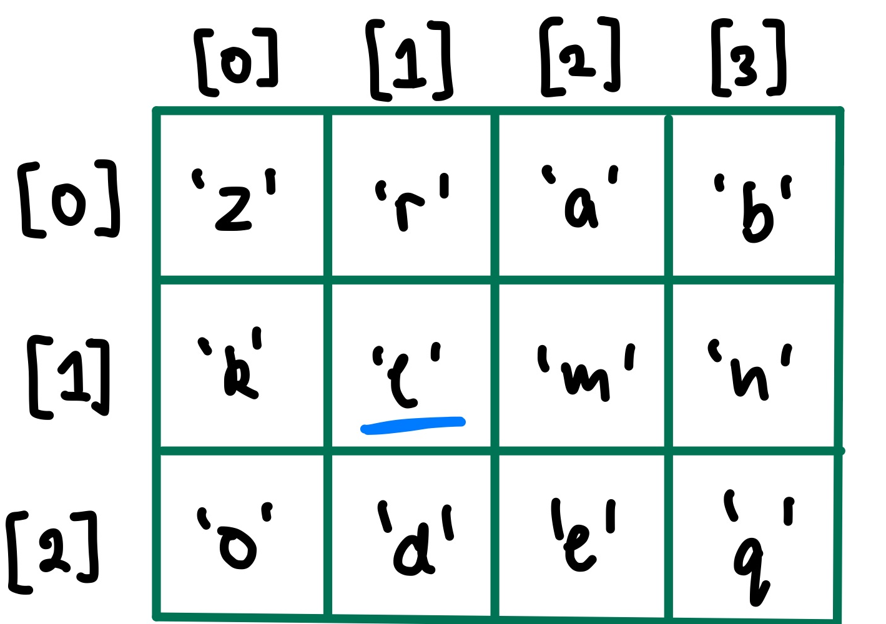

# Multidimensional Arrays

### ```char game_board[MAX_HEIGHT][MAX_WIDTH]```



How would we find the address of where the underlined variable is located?

```assembly
gameboard[1][1]
&game_board + 1 * MAX_WIDTH * SIZEOF(char) + 1 * SIZEOF(char)  # is this complete? yes

# FORMULA TO CALCULATE ADDRESS OF ANY INDEX INTO A 2D ARRAY!!!
array[row][col]
&array + [(row * MAX_WIDTH) + col] * SIZEOF(variable)
```


# Structs


In MIPS, it would look something like this:

```assembly
	# Constants
ZID_OFFSET = 0
FIRST_OFFSET = 4
LAST_OFFSET = 24
PROGRAM_OFFSET = 44
ALIAS_OFFSET = 48
	
	# How would you load program into register $t0?
	# &student1 + PROGRAM_OFFSET
	li	$t0, PROGRAM_OFFSET
	lw	$t0, student1($t1)				# $t0, student1 + $t1
	# can also do
	#lw $t0, student1 + PROGRAM_OFFSET
	.data
student1:		.space 58
```


# Multi-function MIPS Program

```c
int sum(int value, int i) {
  	// i - $t0, 
  	// j - $t1
  	// k - $s0
		int i, j, k;
  
  	i = 5;								// i can be placed in temp
  	k = max(i, value); 		// k must be in saved (must persist through func call)
  	j = get_num();  			// j can be placed in temporary
  
  	return j + k;
}
```

```assembly
sum:
	
	# Any $s registers and $ra register was initialised
sum__epilogue:
	push	$ra
	push	$s0
sum__body:
	li	$t0, 5
	
	move	$a1, $a0			# loading value into 2nd argument register
	move	$a0, $t0			# loading i into 1st argument register
	jal	max
	
	move	$s0, $v0			# k = max(i, value);
	
	jal	get_num
	move	$t1, $v0			# j = get_num();
	
	add	$v0, $t1, $s0

sum__prologue:
	pop	$s0
	pop	$ra
	
	jr	$ra
```

1. When translating to MIPS, what should we look out for when deciding which registers to use?

2. Do we need to push and pop anything?

   Yes, to follow calling convention which states that if you overwrite saved registers, they must return to its initial value at the end of a function


```c
// Example showing how $ra gets updated throughout a function
int main(void) {
									// $ra = exit
  push	$ra
  push	$s0
    
Body:
1	jal sum()
    							// $ra = 2
2	jal multiply()
  
  								// $ra = 3
  li	$s0, 100
0x0000508  func2()
									// $ra = 4
   pop	$s0
4  pop	$ra
  								// $ra = exit
5	jr		$ra;
}

void sum() {
  
  jr	$ra

}
```


