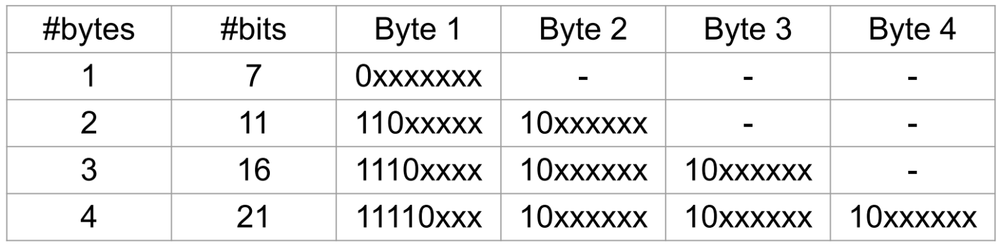

# UTF-8

7. Recall the UTF-8 encoding for characters below:

   Why did UTF-8 replace the ASCII coding standard? What is the difference in how ASCII and UTF-8 codepoints are represented in bytes?

   ```
   UTF-8 is able to represent a much larger range of characters, compared to the 128 characters ASCII can encode.
   
   ASCII codepoints are all one byte width, UTF-8 has variable width codepoints ranging from 1-4 bytes.
   ```

8. Write a C program that reads a null-terminated UTF-8 string as a command line argument and counts how many Unicode characters (code points) it contains. Assume that all codepoints in the string are valid. Some examples of how your program should work:

   ```
   $ dcc count_utf8.c -o count_utf8
   $ ./count_utf8 "チョコミント、よりもあなた！"
   there are 14 codepoints in the string
   $ ./count_utf8 "早上好中国现在我有冰淇淋"
   there are 12 codepoints in the string
   $ ./count_utf8 "🤓🤓🤓🤓🤓🤓🤓🤓"
   there are 8 codepoints in the string
   ```

   **_demo in `count_utf8.c`_**


# Environment variables

4. Write a C program, `print_diary.c`, which prints the contents of the file `$HOME/.diary` to stdout.

   `snprintf` is a convenient function for constructing the pathname of the diary file.

   ```
   <whatever HOME env variable is set to>/.diary
   $HOME/.diary == /import/glass/2/z5420403/.diary
   ```

   